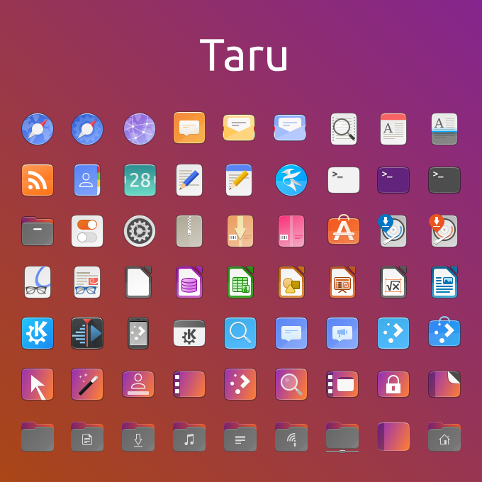

# Naru-icons

Yaru-icons with Other Distro Colors and Desktop Environments

# Features

* Traditional Style - 

# Varients

* Default - Default is Best customization, but different

* Aubergine - Ubuntu Aubergine Colour

* MATE - Yaru-MATE's Taru Mod

* Manjaro - Ubuntu theme with Manjaro Colour

* Remix - Yaru-remix color

# Preview

