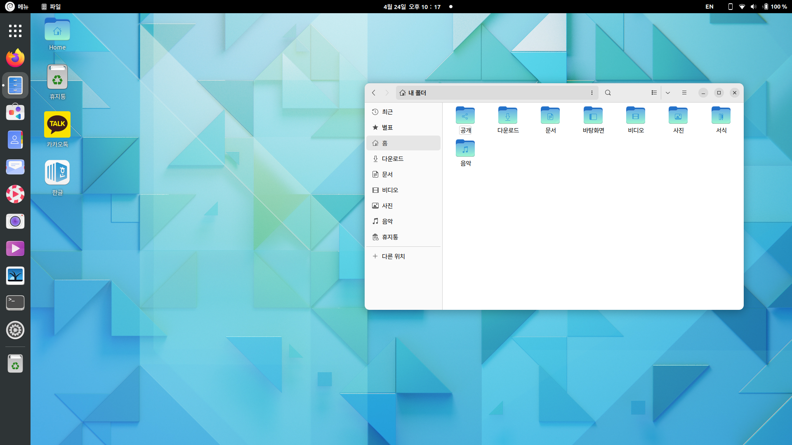
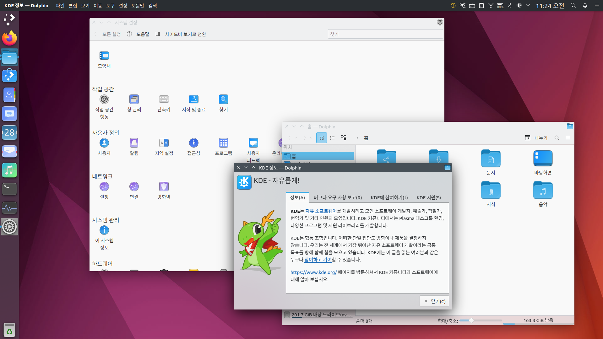
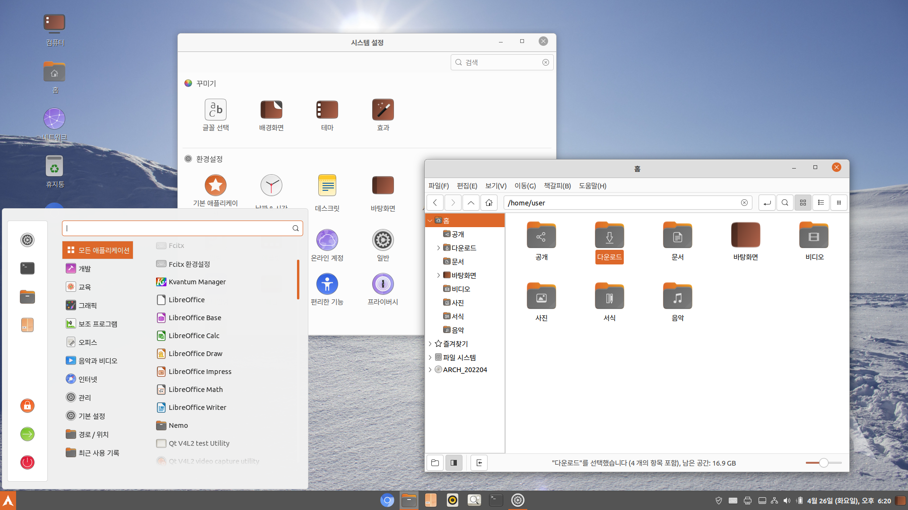
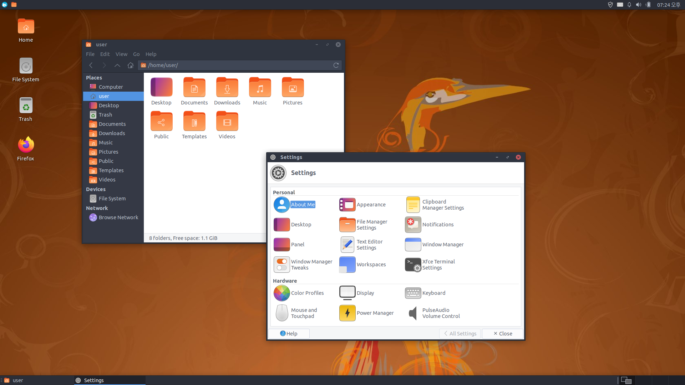
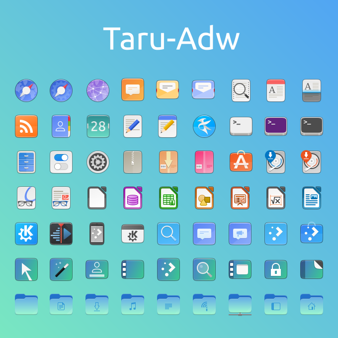
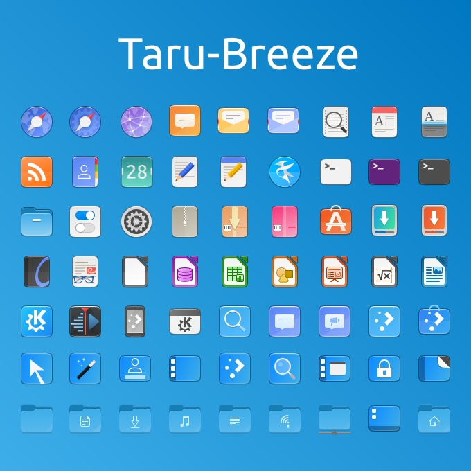
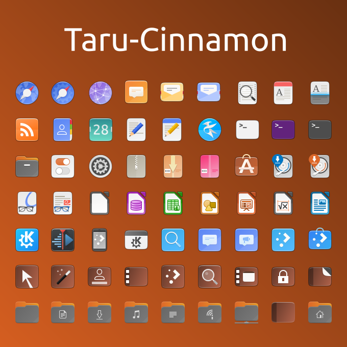
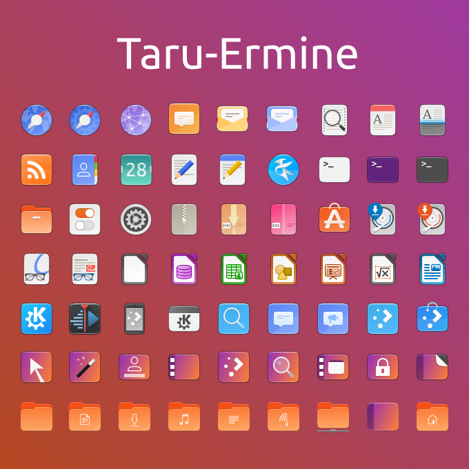

# Taru-icons

Yaru-icons with Other Distro Colors and Desktop Environments, 

# Features

# Varients

* Default - 22.04 Style

* Adw - GNOME 42 Adwaita colors and Yaru-Remix Style

* Breeze - KDE Plasma Style with Yaru

* Cinnamon - Ubuntu Cinnamon Remix Style

* Ermine - 22.04 Design with 19.10 Folder Colors

* MATE - MATE Colors with Ermine

# Preview

